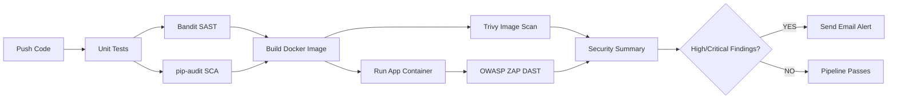

# 📦 DevSecOps Security Pipeline

This repository contains a complete DevSecOps CI/CD security pipeline for a **Flask** application.  
The pipeline runs **automated**:

- Unit tests  
- Static Application Security Testing (**SAST**)  
- Dependency scanning (**SCA**)  
- Docker image vulnerability scanning  
- Dynamic Application Security Testing (**DAST**)  
- Email notifications for HIGH/CRITICAL vulnerabilities  

---

## 🏗️ Pipeline Architecture



---

## 🛠️ Technologies Used

- Flask (Python)
- pytest
- Bandit
- pip-audit
- Docker
- Trivy
- OWASP ZAP
- GitHub Actions
- SMTP Email Alerts

---

## 📁 Repository Structure

```
devsecops-pipeline/
│
├── app/
│   ├── app.py
│   ├── requirements.txt
│   ├── templates/
│   └── tests/
│
├── Dockerfile
├── docker-compose.yml
├── zap-config.yaml
│
└── .github/workflows/ci-security.yml
```

---

## ▶️ Running the Application Locally

**Install dependencies:**
```sh
pip install -r app/requirements.txt
```
**Run app:**
```sh
python app/app.py
```
App will be available at: [http://localhost:5000](http://localhost:5000)

---

## 👩‍💻 Getting Started as a Collaborator

If you'd like to work on this project yourself or collaborate:

1. **Fork the repository:**  
   Click the "Fork" button (top right) to create your own copy of this repo.

2. **Clone your fork:**  
   ```sh
   git clone https://github.com/<your-username>/devsecops-pipeline.git
   cd devsecops-pipeline
   ```

3. **Set up the project:**  
   - Install dependencies:  
     ```sh
     pip install -r app/requirements.txt
     ```
   - (Optional) Set up a virtual environment:  
     ```sh
     python -m venv venv
     source venv/bin/activate  # On Windows: venv\Scripts\activate
     ```

4. **Configure email alerts:**  
   - In your repository settings, add the following secrets if you want email notifications:
     - `MAIL_USERNAME`: Your Gmail address
     - `MAIL_PASSWORD`: Your Gmail App Password
     - `MAIL_TO`: Destination email

5. **Run the Flask app locally:**  
   ```sh
   python app/app.py
   ```
   Visit [http://localhost:5000](http://localhost:5000) in your browser.

6. **Testing the pipeline:**  
   Make and push changes to your fork; GitHub Actions will automatically run the CI/CD pipeline.

7. **Contribute back:**  
   - Open a Pull Request (PR) against the original repo for your improvements or bugfixes.
   - Please follow established code style and provide clear PR descriptions.

**Need help?**  
- Open an [Issue](https://github.com/Farashjr/devsecops-pipeline/issues) if you have any questions or need assistance getting the project running.

---

## 💥 Testing Vulnerabilities

> This project includes an intentionally vulnerable Flask version for pipeline testing.

You can introduce vulnerabilities such as:

- **SQL Injection:**  
  ```python
  db.execute("SELECT * FROM users WHERE username LIKE '%" + q + "%'")
  ```
- **XSS:**  
  ```python
  return f"<h1>Hello {request.args.get('name')}</h1>"
  ```
Push changes — the pipeline will detect and report them.

---

## 📧 Configuring Email Alerts

Create these GitHub secrets for email notification support:

| Secret         | Description          |
|----------------|---------------------|
| MAIL_USERNAME  | Gmail address       |
| MAIL_PASSWORD  | Gmail App Password  |
| MAIL_TO        | Destination email   |

Create Gmail App Password here:  
https://myaccount.google.com/apppasswords

---

## 🧪 Pipeline Stages

1. **build-test-sast**
   - Runs unit tests
   - Bandit SAST
   - pip-audit dependency scan
   - Uploads reports
2. **trivy-scan**
   - Builds Docker image
   - Trivy scans for OS & package vulnerabilities
3. **zap-dast**
   - Runs app container
   - OWASP ZAP automated DAST
   - Uploads HTML report
4. **analyze-security**
   - Aggregates Bandit, pip-audit, Trivy, and ZAP results
   - Generates `security-summary.txt`
5. **notify-security**
   - Sends email if HIGH/CRITICAL issues exist

---

## 📣 Contributions

Contributions are welcome!  
Feel free to open issues or pull requests to improve this pipeline.

---

## 📄 License

Distributed under the MIT License.  
See [LICENSE](LICENSE) for more information.

---

## 🔗 Contact

Questions or support: [Farashjr](https://github.com/Farashjr) via GitHub Issues.
